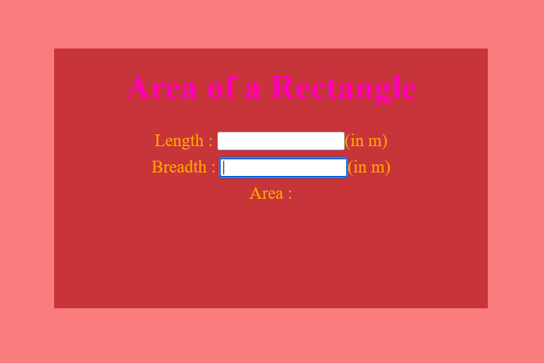

# Design a Website for Server Side Processing

## AIM:
To design a website to perform mathematical calculations in server side.

## DESIGN STEPS:

### Step 1:

Clone the github repository and create Django admin interface.

### Step 2:

Change settings.py file to allow request from all hosts.

### Step 3:

Use CSS for creating attractive colors.

### Step 4:

Write Html,CSS and JavaScript program for implementing five different operations

### Step 5:

Validate the HTML and CSS and jscript code.

### Step 6:

Publish the website in the given URL.

## PROGRAM :
```
<html>
<head>
<meta charset='utf-8'>
<meta http-equiv='X-UA-Compatible' content='IE=edge'>
<title>Area of Rectangle</title>
<meta name='viewport' content='width=device-width, initial-scale=1'>
<style type="text/css">
body
{
background-color:rgb(251, 124, 124);
}
.edge {
width: 1440px;
margin-left: auto;
margin-right: auto;
padding-top: 250px;
padding-left: 300px;
}
.box {
display:block;
width: 500px;
min-height: 300px;
font-size: 20px;
background-color:rgb(199, 52, 57);
}
.formelt{
color:orange;
text-align: center;
margin-top: 7px;
margin-bottom: 6px;
}
h1
{
color:rgb(255, 0, 179);
text-align: center;
padding-top: 20px;
}
</style>
</head>
<body>
<div class="edge">
<div class="box">
<h1>Area of a Rectangle</h1>
<form method="POST">
<div class="formelt">
Length : <input type="text" name="length" value=""></input>(in m)<br/>
</div>
<div class="formelt">
Breadth : <input type="text" name="breadth" value=""></input>(in m)<br/>
</div>
<div class="formelt">
Area : <p id="result"></p>
</div>
<script>
        const length = document.querySelector('#length');
        const breadth = document.querySelector('#breadth');
        message.addEventListener('input', function () {
            result.textContent = length*breadths;
        });
    </script>
</form>
</div>
</div>
</body>
</html>


```
## OUTPUT:




## Result:
The program for implementing area of a rectangle using HTML, CSS and JavaScript is executed successfully.
